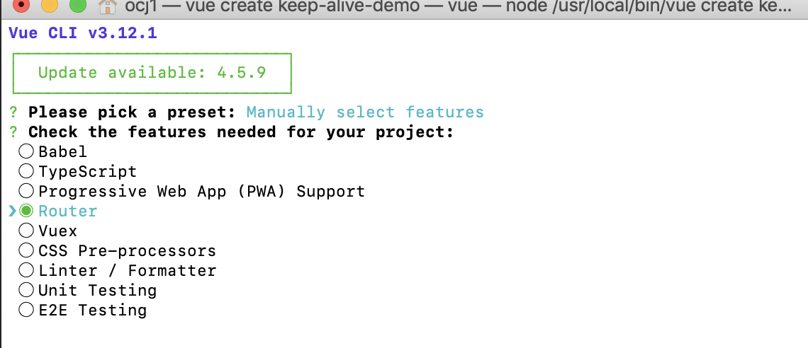
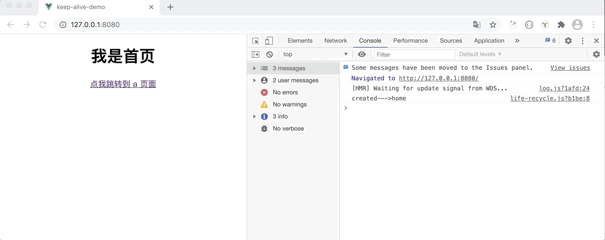

## Vue 中 keep-alive 组件与 router-view 组件的那点事

最近项目中有小伙伴找到我，问我“为啥他写的页面第一次进去可以触发 `onCreate` 函数，第二次再进的时候就不触发了呢？”（因为我们项目是一个大型的项目，每个开发可能只接触到自己开发的一小部分），然后我就说你可以试着在 `activated` 钩子函数中做处理，然后他又接着问我“activated 钩子函数又是怎么调用的呢？”，ok！这小子是问上瘾了，我们下面就来详细解析一下。

## keep-alive

`<keep-alive>` 包裹动态组件时，会缓存不活动的组件实例，而不是销毁它们。和 `<transition>` 相似，`<keep-alive>` 是一个抽象组件：它自身不会渲染一个 DOM 元素，也不会出现在组件的父组件链中。

当组件在 `<keep-alive>` 内被切换，它的 `activated` 和 `deactivated` 这两个生命周期钩子函数将会被对应执行。

> 在 2.2.0 及其更高版本中，`activated` 和 `deactivated` 将会在 `<keep-alive>` 树内的所有嵌套组件中触发。

主要用于保留组件状态或避免重新渲染。

为了更好的来解析 `<keep-alive>`，我们 copy 到一份源码（vue@^2.6.10），`vue/src/core/components/keep-alive.js`：

```js
/* @flow */

import { isRegExp, remove } from 'shared/util'
import { getFirstComponentChild } from 'core/vdom/helpers/index'

type VNodeCache = { [key: string]: ?VNode };

function getComponentName (opts: ?VNodeComponentOptions): ?string {
  return opts && (opts.Ctor.options.name || opts.tag)
}

function matches (pattern: string | RegExp | Array<string>, name: string): boolean {
  if (Array.isArray(pattern)) {
    return pattern.indexOf(name) > -1
  } else if (typeof pattern === 'string') {
    return pattern.split(',').indexOf(name) > -1
  } else if (isRegExp(pattern)) {
    return pattern.test(name)
  }
  /* istanbul ignore next */
  return false
}

function pruneCache (keepAliveInstance: any, filter: Function) {
  const { cache, keys, _vnode } = keepAliveInstance
  for (const key in cache) {
    const cachedNode: ?VNode = cache[key]
    if (cachedNode) {
      const name: ?string = getComponentName(cachedNode.componentOptions)
      if (name && !filter(name)) {
        pruneCacheEntry(cache, key, keys, _vnode)
      }
    }
  }
}

function pruneCacheEntry (
  cache: VNodeCache,
  key: string,
  keys: Array<string>,
  current?: VNode
) {
  const cached = cache[key]
  if (cached && (!current || cached.tag !== current.tag)) {
    cached.componentInstance.$destroy()
  }
  cache[key] = null
  remove(keys, key)
}

const patternTypes: Array<Function> = [String, RegExp, Array]

export default {
  name: 'keep-alive',
  abstract: true,

  props: {
    include: patternTypes,
    exclude: patternTypes,
    max: [String, Number]
  },

  created () {
    this.cache = Object.create(null)
    this.keys = []
  },

  destroyed () {
    for (const key in this.cache) {
      pruneCacheEntry(this.cache, key, this.keys)
    }
  },

  mounted () {
    this.$watch('include', val => {
      pruneCache(this, name => matches(val, name))
    })
    this.$watch('exclude', val => {
      pruneCache(this, name => !matches(val, name))
    })
  },

  render () {
    const slot = this.$slots.default
    const vnode: VNode = getFirstComponentChild(slot) // 获取第一个子节点
    const componentOptions: ?VNodeComponentOptions = vnode && vnode.componentOptions
    if (componentOptions) {
      // check pattern
      const name: ?string = getComponentName(componentOptions) // 获取节点的名称
      const { include, exclude } = this
      if (
        // not included
        (include && (!name || !matches(include, name))) ||
        // excluded
        (exclude && name && matches(exclude, name)) // 不在范围内的节点将不会被缓存
      ) {
        return vnode
      }

      const { cache, keys } = this
      const key: ?string = vnode.key == null
        // same constructor may get registered as different local components
        // so cid alone is not enough (#3269)
        ? componentOptions.Ctor.cid + (componentOptions.tag ? `::${componentOptions.tag}` : '')
        : vnode.key // 获取缓存的 key 值
      if (cache[key]) { // 如果有缓存就使用缓存
        vnode.componentInstance = cache[key].componentInstance
        // make current key freshest
        remove(keys, key)
        keys.push(key)
      } else { // 没有缓存就将当前节点加入到缓存
        cache[key] = vnode
        keys.push(key)
        // prune oldest entry
        if (this.max && keys.length > parseInt(this.max)) { // 如果缓存超过最大限制将不再缓存
          pruneCacheEntry(cache, keys[0], keys, this._vnode)
        }
      }

      vnode.data.keepAlive = true // 标记该节点为 keepAlive 类型
    }
    return vnode || (slot && slot[0])
  }
}
```

其实从源码我们可以看到，代码并没有多少，还是比较简单的，下面我们用一下 `keep-alive` 组件。

#### Props

从源码中我们可以看到，`<keep-alive>` 组件有三个属性：

- `include` - 字符串或正则表达式。只有名称匹配的组件会被缓存。
- `exclude` - 字符串或正则表达式。任何名称匹配的组件都不会被缓存。
- `max` - 数字。最多可以缓存多少组件实例。

下面我们结合 Demo 来分析一下。

我们直接用 `vue-cli ` 创建一个简单的 vue 项目，取名为 `keep-alive-demo`:

```bash
vue create keep-alive-demo
```

然后选一下 `Router` 后一路回车：



我们修改一下 `App.vue` 文件：

```vue
<template>
  <div id="app">
    <router-view/>
  </div>
</template>

<style>
#app {
  text-align: center;
}
</style>
```

然后 `views` 目录创建一个 `A` 组件当作 `页面 A`：

```vue
<template>
  <div class="about">
    <h1>我是 a 页面</h1>
    <router-link to="/pageB">点我跳转到 b 页面</router-link>
  </div>
</template>
<script>
  import LifeRecycle from "../life-recycle";
  export default {
    name: "page-a",
    mixins:[LifeRecycle]
  }
</script>

```

A 页面很简单，里面一个按钮链接到了 B 页面。为了更好的显示每个组件的生命周期，我们为每个页面添加了一个 `mixin`：

```js
export default {
    computed: {
        name(){
            return this.$options.name;
        }
    },
    created(){
        console.log("created--->"+this.name);
    },
    activated() {
        console.log("activated--->"+this.name);
    },
    deactivated() {
        console.log("deactivated--->"+this.name);
    },
    destroyed() {
        console.log("destoryed--->"+this.name);
    }
}
```

直接 copy 一份 `A.vue` 代码创建一个 `页面 B`：

```vue
<template>
  <div class="about">
    <h1>我是 b 页面</h1>
  </div>
</template>
<script>
  import LifeRecycle from "../life-recycle";
  export default {
    name: "page-b",
    mixins:[LifeRecycle]
  }
</script>
```

然后修改一下 `views/Home.vue`：

```vue
<template>
    <div class="home">
        <h1>我是首页</h1>
        <router-link to="/pageA">点我跳转到 a 页面</router-link>
    </div>
</template>
<script>
    import LifeRecycle from "../life-recycle";

    export default {
        name: 'home',
        mixins: [LifeRecycle]
    }
</script>
```

给一个按钮直接链接到了 `页面 A`。

最后我们修改一下 `router.js`：

```js
import Vue from 'vue'
import Router from 'vue-router'
import Home from './views/Home.vue'

Vue.use(Router)

export default new Router({
  mode: "history",
  routes: [
    {
      path: '/',
      name: 'home',
      component: Home,
    },
    {
      path: "/pageA",
      name: "pageA",
      component: () => import(/* webpackChunkName: "about" */ './views/A.vue')
    },
    {
      path: "/pageB",
      name: "pageB",
      component: () => import(/* webpackChunkName: "about" */ './views/B.vue')
    }
  ]
})
```

代码很简单，我就不详细解析了，一个简单的 `SPA`(单页面应用) 就搭建完成了，三个平级的页面 `home`、`pageA`、`pageB`。

我们试着运行一下项目：

```bash
npm run serve
```



可以看到：

1. 首页打开 `home` 页面

   ```js
   created--->home
   ```

   直接触发了 `home` 页面的 `created` 方法。

2.  `home` 页面 ---> `pageA` 页面

   ```bash
   created--->page-a
   destoryed--->home
   ```

   `home` 页面触发了 `destoryed` 直接销毁了，然后触发了`pageA` 页面的 `created` 方法。

3.  `pageA` 页面 ---> `pageB` 页面

   ```bash
   created--->page-b
   destoryed--->page-a
   ```

   `pageA` 页面触发了 `destoryed` 直接销毁了，然后触发了`pageB` 页面的 `created` 方法。

4. `pageB` 页面返回

   ```bash
   created--->page-a
   destoryed--->page-b
   ```

   `pageB` 页面触发了 `destoryed` 直接销毁了，然后触发了`pageA` 页面的 `created` 方法。

5. `pageA` 页面返回

   ```bash
   created--->home
   destoryed--->page-a
   ```

   `pageA` 页面触发了 `destoryed` 直接销毁了，然后触发了`home` 页面的 `created` 方法。

   效果是没问题的，但是作为一个 `SPA` 的项目，这种用户体验肯定是不友好的，试想一下，你现在在一个 app 的首页浏览页面，然后滑呀滑呀，滑动了很长的页面好不容易看到了一个自己感兴趣的东西，然后点击查看详情离开了首页，再回到首页时候肯定是想停留在之前浏览器的地方，而不是说重新又打开一个新的首页，又要滑半天，这种体验肯定是不好的，而且也有点浪费资源，所以下面我们用一下 `<keep-alive>` 把首页缓存起来。

   我们修改一下 `App.vue` 文件：

   ```vue
   <template>
     <div id="app">
       <keep-alive>
         <router-view/>
       </keep-alive>
     </div>
   </template>
   ```

   可以看到，我们添加了一个`<keep-alive>` 组件，然后再次之前的操作：

   1. 首页打开 `home` 页面

      ```js
      created--->home
      activated--->home
      ```

      直接触发了 `home` 页面的 `created` 方法。

   2.  `home` 页面 ---> `pageA` 页面

      ```bash
      created--->page-a
      deactivated--->home
      activated--->page-a
      ```

      `home` 页面触发了 `deactivated` 变成非活跃状态，然后触发了`pageA` 页面的 `activated` 方法。

   3.  `pageA` 页面 ---> `pageB` 页面

      ```bash
      created--->page-b
      deactivated--->page-a
      activated--->page-b
      ```

      `pageA` 页面触发了 `deactivated` 变成非活跃状态，然后触发了`pageB` 页面的 `activated` 方法。

   4. `pageB` 页面返回

      ```bash
      deactivated--->page-b
      activated--->page-a
      ```

      `pageB` 页面触发了 `deactivated` 变成非活跃状态，然后触发了`pageA` 页面的 `activated` 方法。

   5. `pageA` 页面返回

      ```bash
      deactivated--->page-a
      activated--->home
      ```

细心的童鞋应该已经发现区别了吧？每个页面的 `destoryed` 不触发了，替换成了 `deactivated`，然后第一次创建页面的时候除了之前的 `created` 还多了一个 `activated` 方法。

是的！当我们加了`<keep-alive>` 组件后，所有页面都被缓存起来了，但是我们只需要缓存的是 `home` 页面，我们该怎么做呢？

1. 利用 `include` 属性规定缓存的范围

   我们修改一下 `App.vue` 给 `<keep-alive>` 组件添加 `include` 属性：

   ```vue
    <keep-alive :include="['home']">
         <router-view/>
     </keep-alive>
   ```

   `include` 可以是一个字符串数组，也可以是一个正则表达式，匹配的就是组件的名字，比如这里的 `home`，其实就是 `home` 组件的名称：

   ```js
   ...
   export default {
           name: 'home',
           mixins: [LifeRecycle]
       }
       ...
   ```

2. 利用 `exclude` 属性规定不缓存的范围

   这个刚好跟 `include` 属性相反，我们可以修改一下 `App.vue` 给 `<keep-alive>` 组件添加 `exclude` 属性：

   ```vue
   ..
   <keep-alive :exclude="/page-/">
         <router-view/>
       </keep-alive>
   ...
   ```

到这里我们思考一个问题，`<keep-alive>` 是会帮我们缓存组件，但是缓存的数量小倒还好，数量大了就有点得不偿失了，所以 vue 考虑到这个情况了，然后给`<keep-alive>` 添加了一个 `max` 属性，比如我们只需要缓存一个页面，我们只需要设置 `:max=1` 即可：

```vue
..
<template>
  <div id="app">
    <keep-alive :max="1">
      <router-view/>
    </keep-alive>
  </div>
</template>
...
```

`<keep-alive>` 每次会缓存最新的那个页面：

1. 首页打开 `home` 页面

   ```js
   created--->home
   activated--->home
   ```

   直接触发了 `home` 页面的 `created` 方法。

2. `home` 页面 ---> `pageA` 页面

   ```bash
   created--->page-a
   deactivated--->home
   activated--->page-a
   ```

   `home` 页面触发了 `deactivated` 变成了非活跃状态，然后触发了`pageA` 页面的 `created` 方法。

3. `pageA` 页面点击返回

   ```bash
   created--->home
   deactivated--->page-a
   activated--->home
   ```

   `pageA` 页面触发了 `deactivated` 变成了非活跃状态，然后触发了`home` 页面的 `created` 方法。

每次都移除数据的第 0 个位置的缓存，源码为：

```js
// 如果缓存数 > 最大缓存数，移除缓存数组的第 0 位置数据
if (this.max && keys.length > parseInt(this.max)) { 
          pruneCacheEntry(cache, keys[0], keys, this._vnode)
}
...
function pruneCacheEntry (
  cache: VNodeCache,
  key: string,
  keys: Array<string>,
  current?: VNode
) {
  const cached = cache[key] // 获取需要移除的缓存页面
  if (cached && (!current || cached.tag !== current.tag)) { // 如果当前页面跟缓存的页面不一致的时候
    // 触发移除的缓存页面的 destroy 方法
    cached.componentInstance.$destroy()
  }
  cache[key] = null
  remove(keys, key)
}
```

